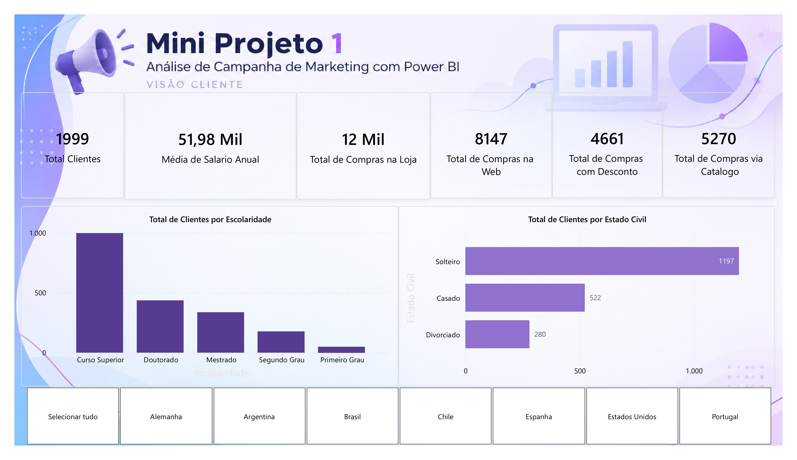
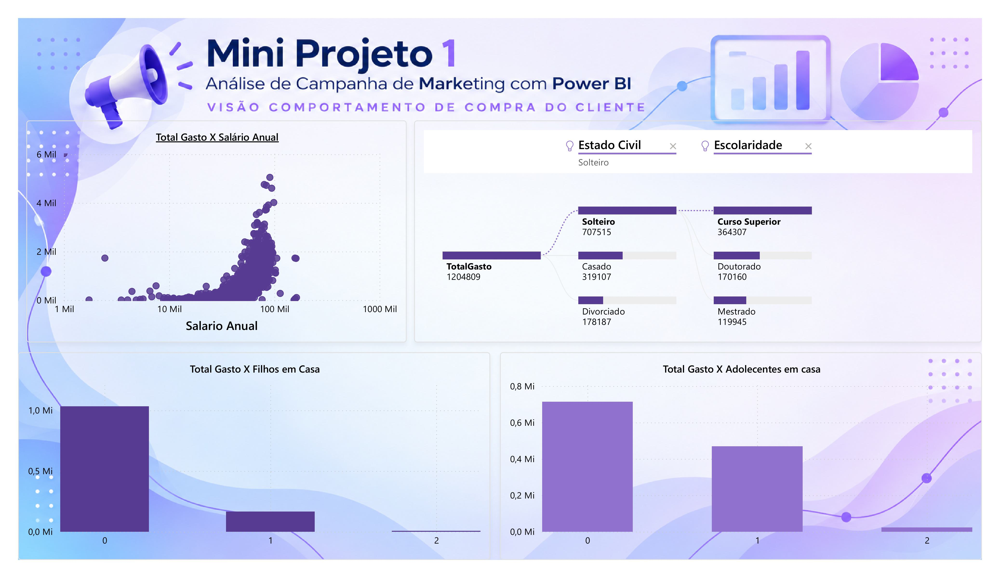
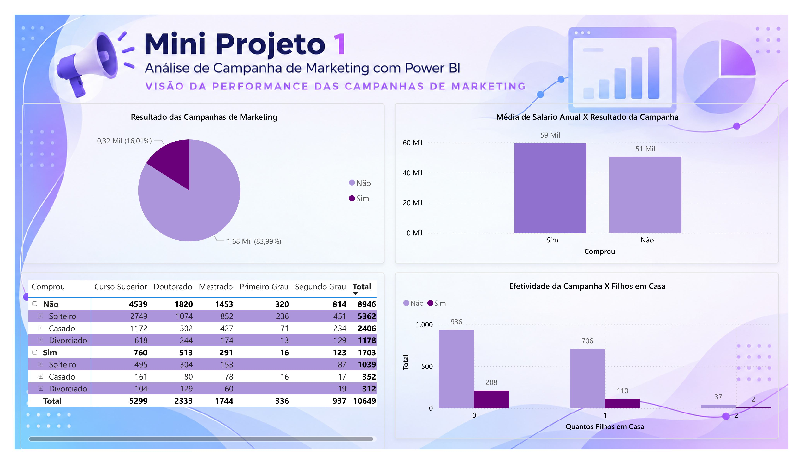
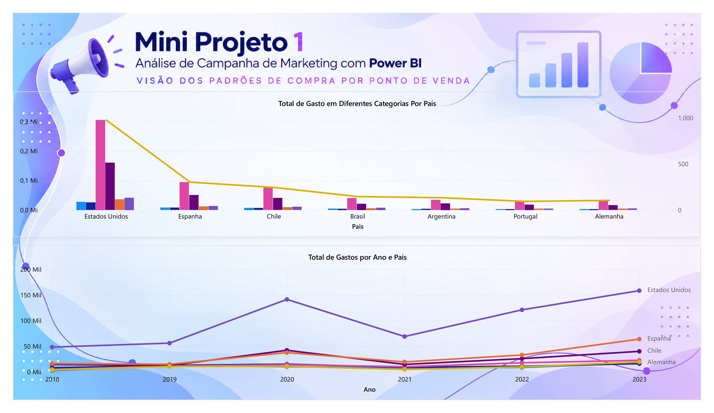

#  Análise de Campanha de Marketing com Power BI

##  Sobre o projeto

Mini projeto de análise de dados desenvolvido no Power BI com o objetivo de explorar o perfil dos clientes, seus comportamentos de compra, o desempenho das campanhas de marketing e os padrões de consumo por país.

##  Ferramenta utilizada

- Power BI Desktop

##  Análises realizadas

###  Perfil dos clientes

Análise da distribuição dos clientes por escolaridade e estado civil, além de indicadores gerais relacionados ao perfil da base.

Entre os indicadores apresentados estão:

- Total de clientes: 1.999
- Média de salário anual: 51,98 mil
- Compras realizadas na loja, web e catálogo
- Compras realizadas com desconto

###  Comportamento de compra

Análise da relação entre gastos, salário anual, quantidade de filhos e adolescentes em casa, além da exploração dos gastos por estado civil e escolaridade.

###  Performance das campanhas

Análise dos resultados das campanhas de marketing, considerando:

- Resultado da campanha;
- Relação entre salário anual e resultado da campanha;
- Distribuição de clientes por escolaridade e estado civil;
- Efetividade da campanha em relação à quantidade de filhos em casa.

###  Padrões de compra por país

Análise dos gastos por país e da evolução dos gastos ao longo dos anos, considerando o período de 2018 a 2023.

##  Dashboards

### Perfil dos clientes

### Comportamento de compra

### Performance das campanhas

### Padrões de compra por país

##  Arquivo do projeto

[Visualizar o PDF completo do projeto](./mini-projeto-marketing.pdf)

##  Autora

**Nicolly Alcântara**

Tecnóloga em Análise e Desenvolvimento de Sistemas | Power BI | Excel | SQL | Análise de Dados
